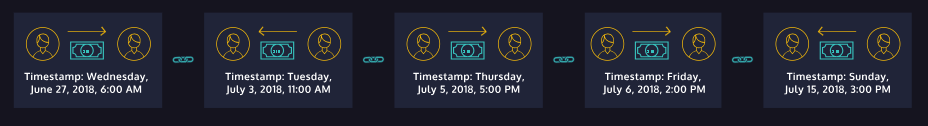

# What is Blockchain?
 
The blockchain is a special kind of database that stores transactions chronologically. Think of what happens in a bank, where a transaction is usually composed of a sender, receiver, and bank. The bank authorizes the transaction as it acts as a central authority.

In the case of blockchain, transactions are chained or linked with the previous ones. Each transaction is stored in a "block." So, intuitively, blockchain is the "chain of blocks." It is protected by cryptography, the process of hiding information from outsiders. There is no central authority; it's a decentralized, immutable ledger (an immutable ledger means that the records cannot be changed).

What verifies the transaction is the public network of computers. It is labeled as the consensus mechanism, where all nodes will reach an agreement.

> Reference: [Learn the Basics of Blockchain with Python | Codecademy](https://www.codecademy.com/courses/introduction-to-blockchain/lessons/blockchain-introduction/exercises/what-is-blockchain)