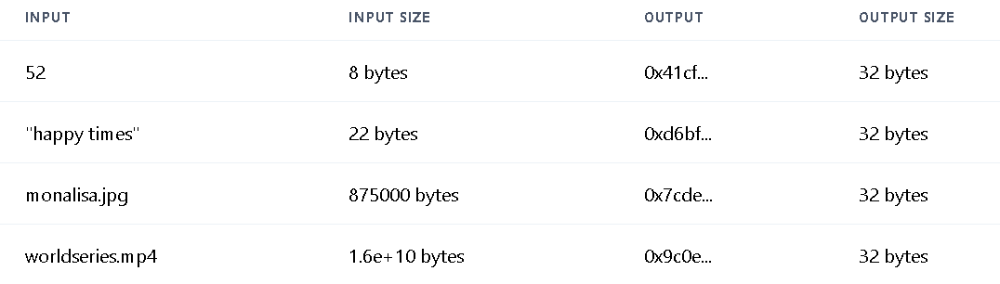

# Cryptography
## Cryptographic Hash Functions

A hash function is a process where a user inputs data, and the function produces a fixed-size output, commonly referred to as a hash. 

Observe how the output size stays the same despite the increasing input size:

This process adheres to five key properties:

1. Deterministic: The same input always yields the same output.
2. Pseudorandom: Similar inputs do not reveal similarities in the outputs.
3. Fast to Compute: The computation is efficient for the computer.
4. One Way: It is computationally infeasible to reverse the process and obtain the original input.
5. Collision Resistant: It is improbable for two different inputs to produce the same hash output.

In the context of blockchains and smart contracts, these hash functions play a crucial role. Typically, only the hash outputs, which are of fixed size, are stored. This practice not only ensures data integrity and security but also optimizes storage space within the blockchain and smart contract ecosystems.